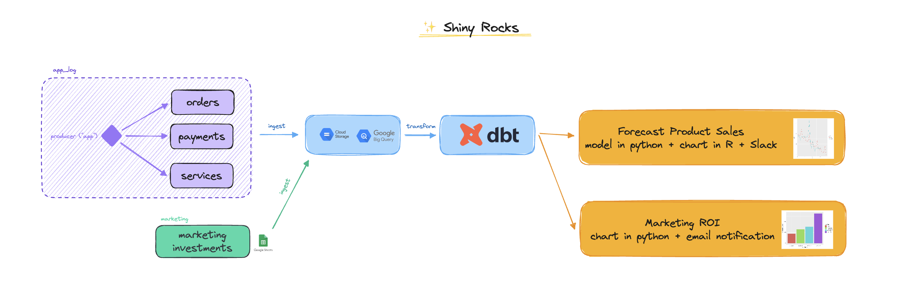

# ✨ Shiny Rocks

**_✨ Shiny Rocks_** is a fictional company creating smartphones (_"those shiny rocks in our pockets"_). This project aims to provide a full working example of Kestra as you could have in a company.

## What is this repo ?

👉 A self-contained Kestra project. Useful for testing, exploring and play with Kestra features.

It contains:
- Flows that **generate** data daily.
- Flows that **consume** external sources and **gather data** into a datalake/data warehouse system.
- Flows that **process and analyze** those data, with chart creations and alerting systems.

## What's in ?

- `./flows` folder: where we store Kestra Flows.
- `docker-compose.yml`: to install the whole project in a self-contained environment.
- Terraform `main.tf` file: to deploy and manage Kestra assets.
- `./shiny_rocks_dbt`: dbt project for data transformation
- `./dataset/produce`: script to generate data + historical data you could backfill in Kestra. As highlighted in introduction, it's all fake data.

Those datasets showcase Shiny Rocks main product - smartphone. Three datasets are created:

- `orders`: represents orders from users as in any classic order table.
- `payments`: represents payments associated to orders. Each payment reference also have a link to affiliated marketing sources to join with `marketing_investments` source.
- `services`: represents services used by users on their smartphone such as Maps, Phone, Music, or Message.

- `marketing_investments`: external source coming from a Google Spreadsheet. Shiny Rocks marketing teams don't like databases and are used to manage their marketing investments into spreadsheets.

## What is this repo not?**

- A tutorial. You can check the [documentation](https://kestra.io/docs) or [videos](https://www.youtube.com/@kestra-io/videos) for real tutorial contents. This project as some limitations due to its self-contained nature.

- A very complex projects. This repository aims to provide ideas and visions about Kestra, we try to keep things simple while showcase important or niche features.

## Setup

## Data Model

